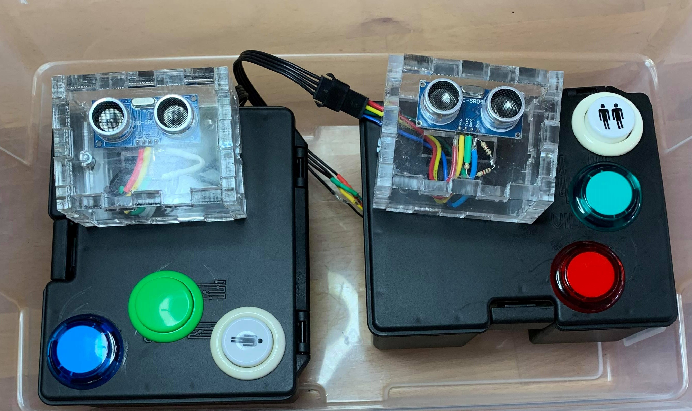

# ColiseumTargetTracker

(Two completed units)

In the last week in February my brother visited Seattle and showed me a new addition to the 
[Coliseum V Facility](https://coliseumv.com/).  On the playfield are two separate mounted 
slingshots from which players attempt to launch a ball into their opponent's goal.  The goals 
are converted 250 gallon water containers with an aluminum housing around them.  They look like
this.

The goal in the center of the target is 18" wide by 23" tall. 

My brother asked if I could build a system for tracking successful goals and showing a point total for an ongoing game.  

To keep things simple we decided to go with Raspberry Pi with directly connected monitors for the display.  While I was 
really excited to replicate a huge 7 segment display that I had seen before (the 
[ninja timer project](https://learn.adafruit.com/ninja-timer-giant-7-segment-display)) a monitor requires far less
manual labor (no need to build the custom 7 segment display) and it provides the option to create animations and 
future flexibility.  

## Sensors

An important component of the installation is the ability to detect when a shot goes into the goal and react 
automatically.  While there will be buttons on the control panel to manually increase or decrease the score 
(to handle false positives and false negatives) these are intended to be used rarely if at all.  There are a 
number of options that are being considered.

### Ultrasonic

The idea here is to mount, within an acrylic enclosure, a simple HC-SR04 Ultrasonic sensor.  Using a voltage divider 
to protect the 3.3v pin (1k resistor and then 2k resistor) we can meansure the distance to the nearest object and then react if there is a change.  See [this example](https://thepihut.com/blogs/raspberry-pi-tutorials/hc-sr04-ultrasonic-range-sensor-on-the-raspberry-pi) for a general tutorial.

### Vibration sensor

The idea is that a ball striking the interior of the enclosure can be recognized using a tuned vibration sensor 
similar to the [Hiletgo SW-420](https://www.amazon.com/gp/product/B00HJ6ACY2/).  I am thinking that this one will 
be difficult to tune and get correct - even when using multiple of them.  The potential for false positives when
a ball strikes the outside exists even when using multiple sensors.  I won't really know until I get to the facility.

### Weight sensor

The idea here is that a board across the bottom of the goal area can have weight sensors on it to recognize when the 
ball is within the goal.  This won't recognize when the ball hits in and bounces out.  Something like the [HX711](https://www.amazon.com/gp/product/B079FTXR7Y/) may work.

## Requirements

The game is played with a target that is 18" wide by 23" tall.   The depth of the box into which the players are shooting is (approximately) 30" deep.  The most difficult set of requirements is when the players are shooting an arrow into the openinig using a 'standard' archery tag bow.  These are 28 pound bows shooting foam tipped arrows.  From http://bestcompoundbowsource.com/whats-bows-real-speed/ a 70lb bow pulled back to 30" and firing a 350gram arrow has a speed of 320 feet per second.  Accounting for the difference in bow strength from 70lbs to 28lbs (28 pounds as mandated by 'official' archery tag rules, although the cheapo bows on Amazon have a 16-20lb draw weight) this is a reduction to 240 feet per second.  The pull back for most of these bows is 22-24" so this is a further reduction of speed to 160 feet per second.  The weight of the arrow is also a factor where the foam tip is likely another 50 grams which will slow the arrow further to 145 feet per second.  

This is all theoretical though.  From Flip's description it is possible, but not easy, to shoot the arrow the entire length of the 90 foot long field but you have to aim at 45 degrees to do so.  He also estimates that the time required is 3 seconds.  Plenty of time for a player to duck out of the way if someone were to shoot at them from across the field.  

Using http://omnicalculator.com/physics/projectile-motion if the initial velocity is 60 feet per second and shot at a 45 degree angle then the flight time would be 2.76 seconds and goes 117 feet.  This is close enough to the approximate experience-based values so we can use 60 feet per second as our metric.

Worst case scenario is to shoot within the box and ricochet right back out.  The distance to travel here is 5 feet total.  Assuming that the arrow is traveling 60 feet per second then I have 0.083 seconds, or 83 milliseconds, in order to detect the arrow.  This is a detection rate of just 12 hertz.  Definitely doable using a variety of technologies.

